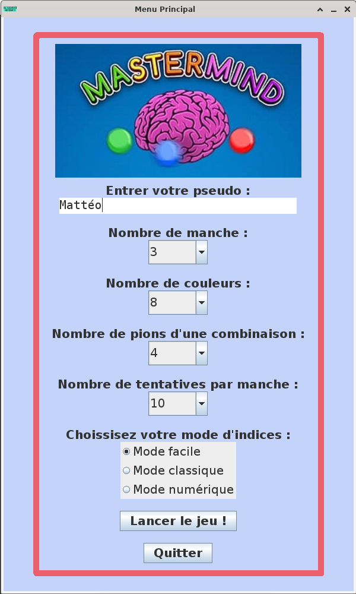
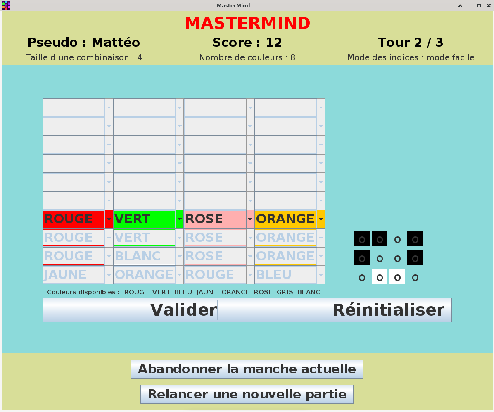
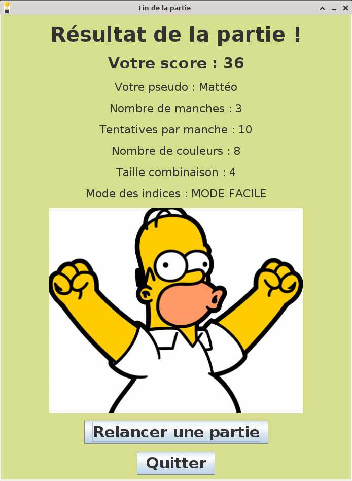

Mastermind
==========

Projet de réalisation d'un jeu de Mastermind en JAVA sur une durée de 2 mois en groupe de 2 personnes dans le contexte de mes études (2023).

## Installation

Le document [INSTALL.md](https://github.com/matteorenaud/mastermind/blob/main/INSTALL.md) indique les étapes d'installation de l'application.

## Fonctionnalités

Le jeu permet de jouer au Mastemind selon 3 mode de jeu :
- Mode facile
- Mode classique
- Mode numérique
Le joueur peut aussi choisir le nombre de pions, de couleurs et de manches.

L'interface graphique du jeu est très simple.

## Exemple du déroulement d'une partie

L'application se compose de 3 écrans :
- Selection des paramêtres
- Jeu
- Fin de partie

Lors du lancement de l'application, le joueur arrive sur l'écran de séléction des paramêtres.

Le joueur entre son pseudo, le nombre de manche, le nombre de couleurs, le nombre de pions d'une combinaison, le nombre de tentative par manche et le mode d'affichage des indices.

Une fois la sélection des paramêtres par le joueur, celui-ci arrive sur le plateau de jeu.

Le jeu se joue avec des ComboBox. Cela est très simple à comprendre et à utiliser pour le joueur. 

A tout moment dans la partie, le joueur peut valider sa combinaison, abandonner la manche ou relancer une partie avec les même paramêtres.

Quand, toutes les manches on été jouées, une écran de fin récapitule le score et les informations de la partie.

Le joueur peut quitter ou relancer une partie et choisir de nouveaux paramêtres de jeu.
