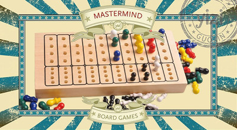

Mastermind
==========

L'objectif de ce projet est de concevoir une application permettant à un joueur de jouer au mastermind contre l'ordinateur.

Consignes générales
-------------------

#### Pour démarrer avec le dépôt Git

1. Créez un groupe `nom1-nom2` où nom1 et nom2 sont les noms de famille des deux membres du binôme
1. Forkez le dépôt https://git.unistra.fr/a313/a31-mastermind dans le groupe créé ci-dessus
1. Ajoutez le responsable du module et votre enseignant de TD/TP comme Reporter de votre dépôt

#### Pour toute la durée du projet

- Ce projet est à réaliser **en binôme**.
- Vous devez concevoir en UML et implémenter en Java le jeu du Mastermind, en respectant une **architecture MVC** et en proposant une **interface graphique en Swing**.
- Vous devez respecter les **principes de conception** et mettre en œuvre les **patrons de conception** vus en cours, **lorsque cela est pertinent**. Attention, il ne s'agit pas d'essayer d'utiliser tous les patrons de conception vus en cours !
- Vous rédigerez parallèlement **un (ou des) rapports** pour expliquer vos choix de conception. Il est possible aussi que vous soyez amenés à renoncer à une partie du développement par manque de temps. Dans ce cas, le rapport est l’endroit où le signaler ("il aurait fallu faire *ceci* mais je n’avais pas assez de temps devant moi et j’ai préféré me concentrer sur *cela* parce que ...").
- Votre dépôt devra être **mis à jour au minimum après chaque séance de TP** de façon à ce que nous puissions évaluer votre démarche sur toute la durée du projet.

Les règles du jeu
-----------------

Pour les règles classiques, vous pouvez consulter :

- une version simple [https://www.regles-de-jeux.com/regle-du-mastermind/](https://www.regles-de-jeux.com/regle-du-mastermind/).
- une explication plus complète : [https://fr.wikihow.com/jouer-au-Mastermind](https://fr.wikihow.com/jouer-au-Mastermind).

#### Le vocabulaire

Au niveau du vocabulaire, nous emploierons les termes suivants :

- une **combinaison** : c'est une ligne de pions
  - il y a la **combinaison secrète** et les combinaisons tentées par le joueur, appelées **tentatives**.
- un **indice** : information sur le pion d'une combinaison, donnée par l'ordinateur, qui indique si le pion est bien placé, mal placé ou absent
- une **ligne d'indices** : c'est ensemble des indices associés à une combinaison
- une **manche** : c'est l'ensemble des tentatives ayant permis ou non de trouver une combinaison secrète
- une **partie** : c'est un ensemble de manches

Les fonctionnalités
-------------------

Vous devez modéliser et implémenter :

- la génération de la combinaison secrète,
- la génération des indices associés à une combinaison proposée par le joueur,
- la détection de la victoire et de la défaite du joueur,
- la gestion des manches et des parties,
- la gestion du score

en prenant en compte ces spécificités :

- votre application doit disposer au maximum de **8 pions différents**
- avant de démarrer une partie, le joueur fixe ces paramètres qui seront les mêmes pour toutes ses manches :
  - le **nombre de manches** : 3 par défaut, 5 maximum
  - le **nombre de pions disponibles** : 8 par défaut, 8 maximum, 4 minimum
  - le **nombre de pions d'une combinaison** : 4 par défaut, 6 maximum
  - le **nombre de tentatives** maximum pour trouver la combinaison secrète : 10 par défaut, 12 maximum
- le **score d'une manche** est calculé à partir de la dernière tentative du joueur comme la somme du nombre de pions mal placés, de trois fois celle du nombre de pions bien placés et de 4 points bonus si on est en mode classique.

L'interface graphique
---------------------

Votre application doit proposer 3 écrans :

- un **écran de démarrage** pour choisir les paramètres : nom du joueur, type de partie, etc.
- un **écran de jeu** avec le plateau qui affiche les combinaisons tentées, les indices associés, etc.
- un **écran de fin de partie** qui affiche le score du joueur et s'il a gagné ou perdu

#### Les interactions de l'utilisateur

Un joueur doit pouvoir réaliser les actions suivantes à **n'importe quel moment d'une partie** :

- choisir les couleurs de sa prochaine combinaison
- valider sa combinaison pour recevoir l'indice de l'ordinateur
- remettre à zéro sa combinaison
- abandonner la manche courante pour passer à la suivante
- modifier le **mode d'affichage des indices** :
  - soit en **mode "facile"** : les jetons noirs et blancs sont affichés en correspondance de la combinaison proposée par le joueur (i.e. à la même place)
  - soit en **mode "classique"** (mode par défaut) : les jetons noirs sont affichés en premier, puis les jetons blancs
  - soit en **mode numérique** : on affiche le nombre de pions bien placés et le nombre de pions mal placés.

Bonus : pouvoir recommencer une partie sans relancer l'application.

Les rendus
----------

### 1er rendu

Date limite : le dimanche **10/12 à 23h59**

Documents :

- le **diagramme de classes** UML
  - le package `model` doit être décris en anticipant tout le développement
  - les packages `controller` et `view` doivent proposer une version de base mais peuvent être incomplets
- le **code source**
- un **rapport** pour expliquer vos choix de conception

Le rendu est à faire sur votre dépôt Git **sur une branche nommée `rendu1`**.

### 2ème rendu

Date limite : le vendredi **14/01 à 23h59**

Documents :

- le **diagramme de classes** UML
	- il doit être entièrement cohérent avec le code
	- il doit représenter l'intégralité de votre application
- le **code source**
- un **exécutable au format JAR**
- un **mode d'emploi** nommé `INSTALL.md` à la racine de votre projet, qui explique comment installer et lancer votre application
- un **rapport** pour présenter vos nouveaux choix de conception depuis le 1er rendu et expliquer les raisons des évolutions des choix de conception qui avaient été annoncés au 1er rendu.

Le rendu est à faire sur votre dépôt Git **sur une branche nommé `rendu2`**.

### Précisions

- Vos diagrammes UML doivent être au format PlantUML et svg,
- À la fin du projet, votre dépôt devra contenir au minimum une branche `rendu1` et une branche `rendu2`, ce seront les seules branches évaluées. Vous êtes libre de gérer le reste de votre dépôt comme vous le souhaitez.
- Pensez à vérifier que votre exécutable fonctionne sur Linux, Windows et Mac.
